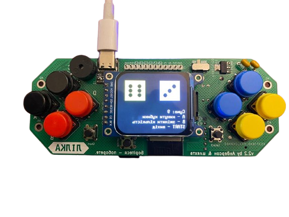
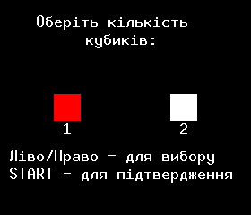
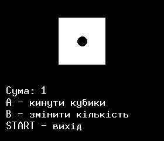
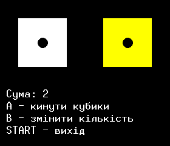

# Гра "Кубики" для lilka.dev

Проста та захоплююча гра в кубики, розроблена для консолі [lilka.dev](https://lilka.dev/). Гравці можуть вибирати між грою з одним або двома кубиками, що робить її універсальною для різних ігрових сценаріїв.

## Особливості

- Вибір між грою з 1 або 2 кубиками
- Анімація кидання кубиків
- Звукові ефекти для кидків та вибору
- Підрахунок загальної суми
- Чистий та інтуїтивний інтерфейс

## Стани гри

Гра має три основні стани:
1. Екран привітання
2. Вибір кількості кубиків
3. Ігровий екран

### Екран вибору кубиків

На цьому екрані ви можете:
- Вибрати кількість кубиків (1 або 2)
- Використовувати кнопки ЛІВО/ПРАВО для навігації
- Натиснути START для підтвердження вибору

### Ігровий екран

На ігровому екрані ви побачите:
- Один або два кубики (залежно від вашого вибору)
- Поточну суму значень
- Інструкції з керування

## Керування

### Екран привітання
- `START` - Почати гру

### Екран вибору кубиків
- `ЛІВО/ПРАВО` - Перемикання між варіантами з 1 та 2 кубиками
- `START` - Підтвердження вибору та початок гри

### Ігровий екран
- `A` - Кинути кубики
- `B` - Повернутися до вибору кількості кубиків
- `START` - Вихід з гри

Розроблено для [lilka.dev](https://lilka.dev/) 
https://github.com/and3rson/lilka
